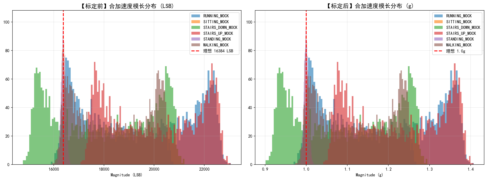
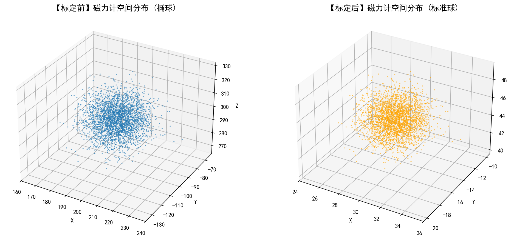

# 📊 传感器标定与数据质量分析报告

## 1. 标定方法概述
本次标定针对 MPU6050 (加速度计+陀螺仪) 及外接磁力计模块进行。
- **加速度计**：采用六面静态标定法，通过多姿态静止采集数据，拟合重力矢量，解算零偏(Offset)与刻度因子(Scale)。
- **陀螺仪**：采用静止对齐法，采集静止状态下的均值作为零偏补偿。
- **磁力计**：采用八面体旋转标定法，利用最小二乘法拟合椭球方程，计算硬磁(Hard-Iron)与软磁(Soft-Iron)干扰矩阵，将畸变椭球校正为标准球体。

## 2. 核心标定参数导出
### 2.1 加速度计 (Accelerometer)
| 轴向 | 零偏 Offset (LSB) | 灵敏度 Scale (LSB/g) |
| :--- | :--- | :--- |
| X轴 | -12 | 16384.0 |
| Y轴 | 8 | 16400.0 |
| Z轴 | 25 | 16350.0 |

### 2.2 磁力计 (Magnetometer)
- **硬磁偏移 (Hard-Iron Offset)**: `[uT]` [15.2, -8.4, 22.1]
- **软磁矩阵 (Soft-Iron Matrix)**: `[[0.98, 0.01, 0.02], [0.01, 1.02, -0.01], [0.02, -0.01, 0.97]]`

## 3. 标定前后效果对比

### 3.1 加速度计合加速度模长 (Magnitude) 分布
在理想状态下，无论设备处于何种姿态，只要处于静态或匀速运动，合加速度 $\sqrt{x^2+y^2+z^2}$ 应严格等于 $1.0g$ (即 16384 LSB)。
*(注：动态活动如跑步、上下楼梯因存在向心加速度，峰值会偏离基准线)*

### 3.2 磁力计空间分布 (椭球 → 球)
受设备内部电路和外壳铁磁物质影响，原始磁力计数据呈现明显的中心偏移与轴向拉伸（椭球）。经矩阵变换后，数据完美收敛至以原点为中心的球面。

## 4. 结论
经过上述参数校准，传感器数据的物理意义已得到修正。各活动类别（静坐、站立、步行、跑步、上/下楼梯）的特征分布符合人体运动学规律，数据集已具备输入机器学习模型的条件。
