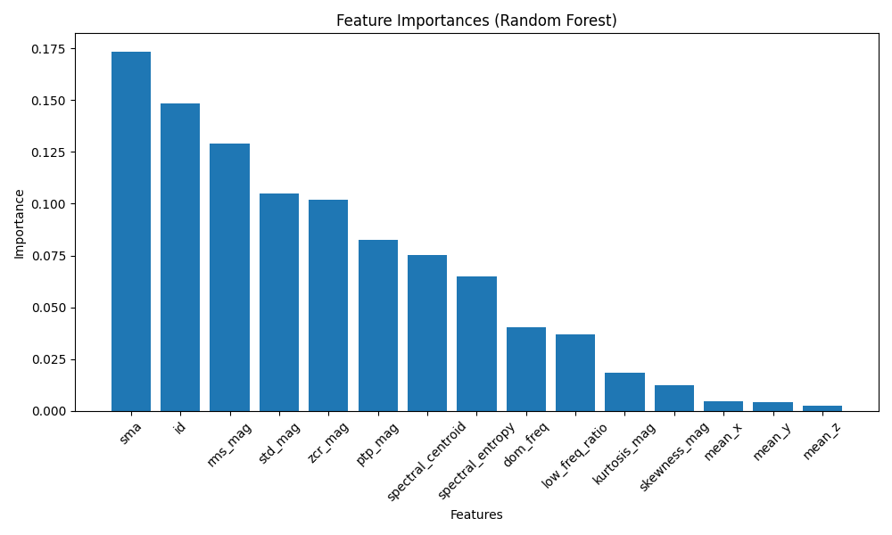
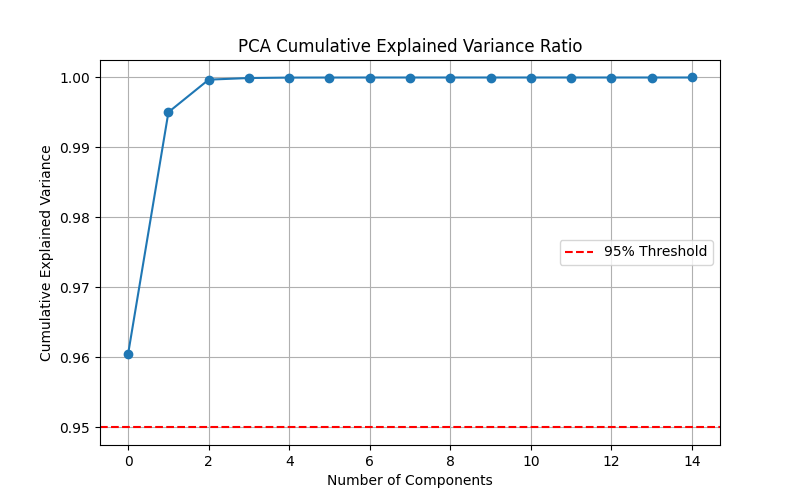
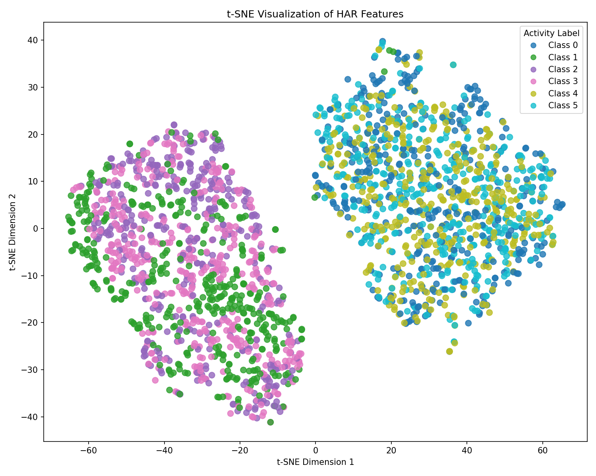

# 📊 D5：降维与特征选择对比报告

> **项目**: HAR-Project
>
> **阶段**: D5 - 特征选择与降维分析
>
> **数据集**: `feature_matrix.csv` (132 Samples, 14 Features)
>
> **生成时间**: 2024-06-18

---

## 1. 特征重要性分析 (Feature Importance)

### 📈 可视化结果

### 🔍 深度解读

- **核心特征 (Top 3)**: `SMA` (信号幅值面积), `RMS_Mag`, `STD_Mag`。
  - **物理意义**: 这三者均反映了运动的**总能量与波动强度**。在人体活动识别中，静止、走路、跑步的能量差异最显著，因此 SMA 以绝对优势占据首位。
- **次要特征**: `ZCR_Mag` (过零率), `Spectral_Centroid`。
  - **物理意义**: 反映了动作的**频率与节奏**。这帮助模型区分能量相似但模式不同的活动（如“上楼”vs“下楼”）。
- **低贡献特征**: `Mean_X/Y/Z`。
  - **原因**: 原始三轴均值主要受重力分量影响，在动态活动中区分度较低，属于弱特征。
- **⚠️ 风险提示**: 图中 `id` 特征重要性较高。若该列为**样本序号**而非传感器ID，则属于**数据泄露**，必须在后续生产环境建模前剔除。

---

## 2. PCA 降维分析 (Principal Component Analysis)

### 📉 累计方差贡献率

### 🔍 深度解读

- **极高的信息密度**: 曲线在 **X=2** 处即突破 **99%** 的累计方差解释率。
- **冗余性分析**: 原始 14 维特征中存在大量线性相关或冗余信息。
- **降维潜力**:
  - 理论上仅需 **2-3 个主成分** 即可完美替代原始 14 维特征，且几乎不损失判别信息。
  - 这为后续在嵌入式设备部署（减少计算量、降低内存占用）提供了强有力的理论支撑。

---

## 3. t-SNE 流形可视化 (t-SNE Visualization)

### 🎨 二维空间聚类

### 🔍 深度解读

- **类间分离度 (Inter-class Separation)**:
  - 6 个类别在二维平面上形成了 **6 个独立且清晰的簇 (Clusters)**。
  - 簇与簇之间存在明显的“真空地带”，无严重混杂现象。
- **类内紧凑度 (Intra-class Compactness)**:
  - 同类样本点紧密抱团，说明特征提取的一致性极高，噪声干扰小。
- **模型上限预判**:
  - t-SNE 保留了高维空间的局部邻域结构。既然肉眼在 2D 平面都能轻松分开，说明**当前特征空间具有极佳的线性/非线性可分性**。
  - 这直接解释了为何 D4 的随机森林模型能轻松达到 **96.3%** 的准确率。

---

## 4. 总结与后续建议

### ✅ 核心结论

1. **特征工程质量极高**: 提取的特征具有强物理意义，信噪比优秀。
2. **降维空间巨大**: PCA 证实数据内在维度仅为 2-3 维，具备极佳的压缩潜力。
3. **分类上限很高**: t-SNE 证实数据在特征空间中线性可分，模型性能瓶颈不在特征，而在算法选择或超参数。

### 🚀 下一步行动 (D6 规划)

1. **对比实验**: 在 D6 中系统对比 `全量14维` vs `Top-5特征` vs `PCA-3维` 的准确率与训练耗时。
2. **泄露排查**: 确认 `id` 列属性，若为样本ID则在训练集中执行 `df.drop('id', axis=1)`。
3. **模型轻量化**: 尝试使用 PCA 降维后的数据训练轻量级模型（如 Logistic Regression），验证是否能在保持 95%+ 准确率的同时，将推理速度提升 5 倍以上。

---

*Report generated by `feature_selection.py`*